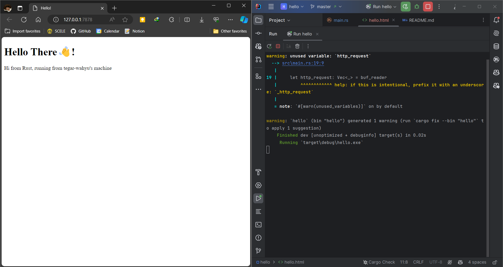
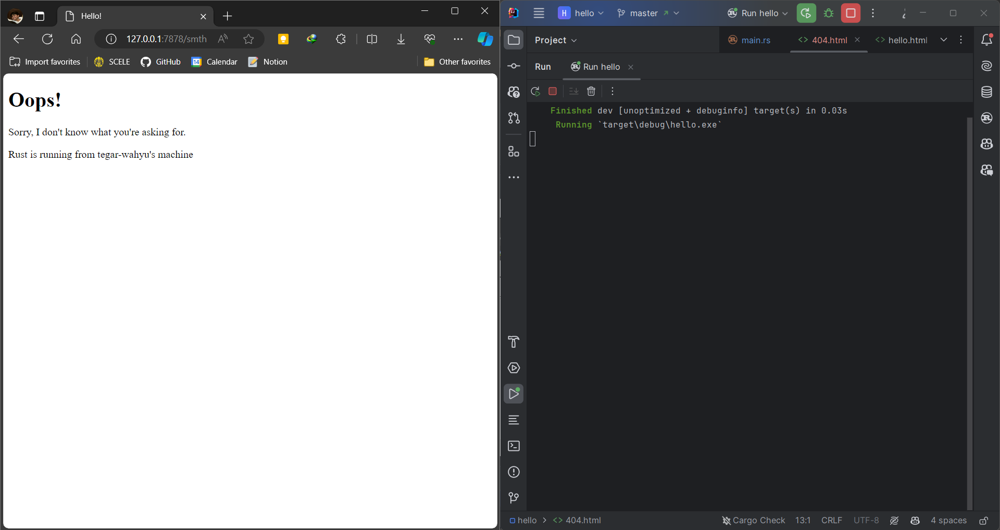

# Reflection

## Commit 1 Reflection notes
>Pada milestone pertama ini, Saya membuat Single-Threaded Web Server. 
Berikut adalah cara kerja dan kegunaan kode yang telah saya tulis menurut pemahaman saya.

Modul `std::io::prelude` dan `std::io::BufReader` digunakan untuk membaca dan menulis ke 
stream. Method `handle_connection` dibuat untuk menangani koneksi masuk, di mana ia membuat
instance `BufReader` yang membungkus stream tersebut. `BufReader` mengimplementasikan trait
`BufRead` yang menyediakan metode `lines` untuk mendapatkan setiap baris request HTTP 
dari browser. Setelah itu, baris-baris request tersebut dicetak dalam format yang 
dapat dibaca. Ketika program dijalankan dan request dikirim melalui browser, output akan
menampilkan baris-baris request HTTP yang telah dikirim oleh browser.

## Commit 2 Reflection notes
>Pada milestone kedua ini, Saya menggunakan modul filesystem Rust untuk membaca isi file dan mengirimkannya sebagai
respons server HTTP.

Proses ini diawali dengan mengimpor modul `fs` untuk mengakses modul `filesystem`. Kemudian, isi file 
`hello.html` dibaca dan di-convert ke dalam sebuah string menggunakan fungsi `fs::read_to_string("hello.html").unwrap();`. 
Selanjutnya, isi file tersebut diformat menjadi respons HTTP yang valid dengan menambahkan 
header `Content-Length` yang berisi panjang konten. Terakhir, respons dikirim ke klien melalui objek stream menggunakan metode `write_all`.



## Commit 3 Reflection notes
>Pada milestone ketiga ini, Saya menambahkan validasi untuk request HTTP dan selectively responding
pada request yang valid.

Kode yang telah ditambahkan menggunakan `next` untuk hanya membaca baris pertama
dari HTTP request dan disimpan dalam variabel `request_line`.
```shell
Request: [
 "GET / HTTP/1.1", <--- baris pertama
 "Host: 127.0.0.1:7878", "Upgrade-Insecure-Requests: 1",
 ...
]
```
Jika `request_line` berisi request `GET /`, maka isi  file `hello.html` 
akan dikirimkan sebagai respons. Namun, jika bukan request `GET /`, kode 
akan dieksekusi pada blok `else` untuk menangani request tidak valid dengan
mengirimkan file `404.html`.

Refactoring dilakukan karena kode yang ditambahkan pada milestone ini
hampir sama dengan kode yang telah ditulis pada milestone kedua.
Perbedaannya hanya pada `status_line` dan `filename`.



## Commit 4 Reflection notes
>Pada milestone keempat ini, Saya melakukan simulasi slow response dengan menambahkan 
delay 10 detik pada server.

Milestone ini mengubah `if-else` menjadi `match` untuk menangani tiga jenis request HTTP: 
`GET /`, `GET /sleep`, dan request lainnya. Untuk request `GET /sleep`, server akan 
tidur (sleep) selama 10 detik sebelum mengirimkan respons. Ketika server dijalankan dan 
request `/sleep` dilakukan, request lain seperti `/` akan tertunda sampai waktu sleep 
(10 detik) selesai sebelum merespons.